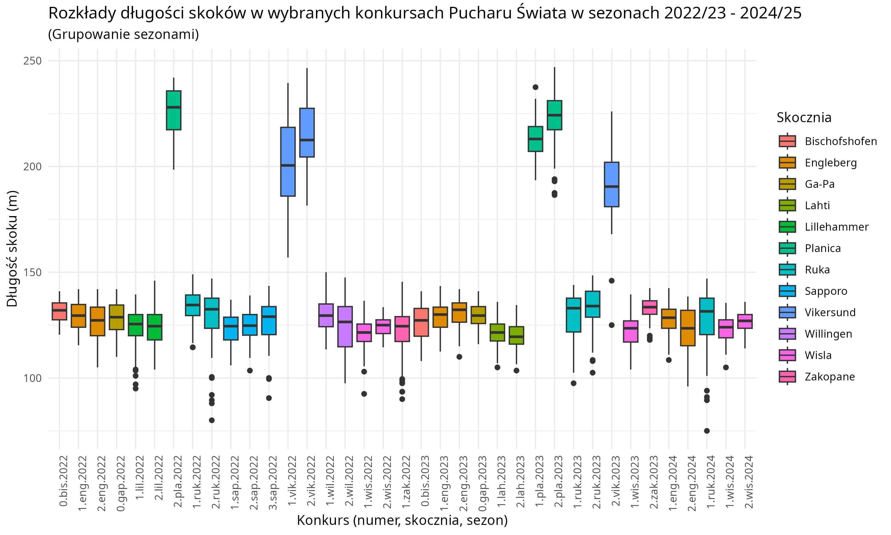
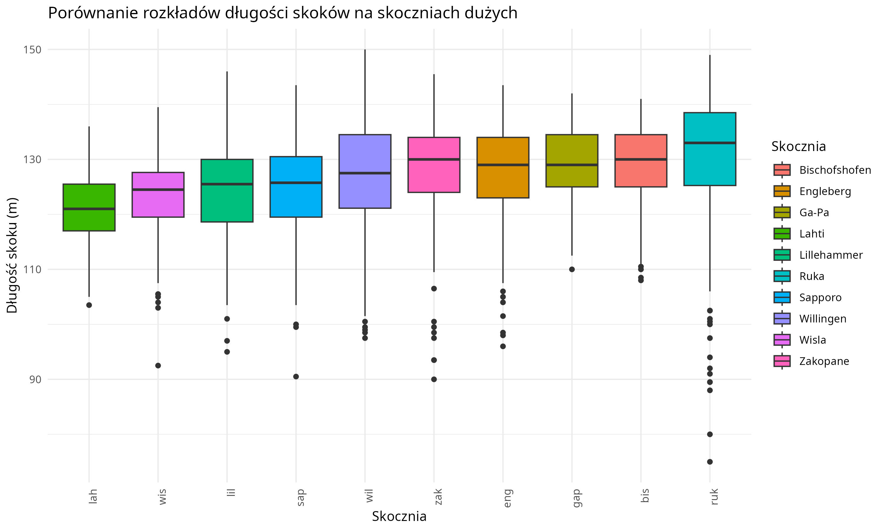
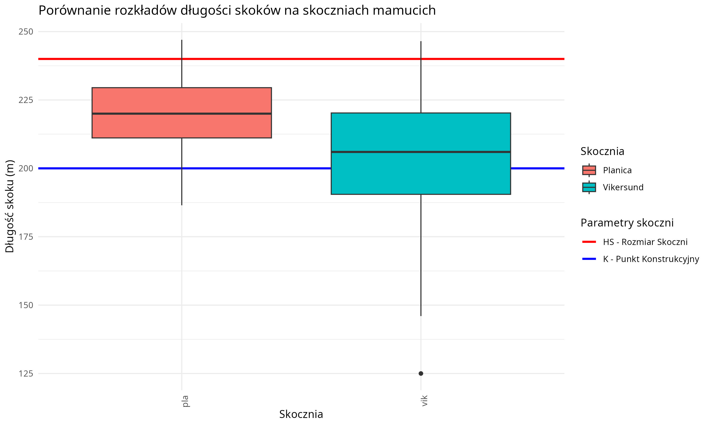

```{r setup, include=FALSE}
knitr::opts_chunk$set(echo = FALSE)
```

## <b>O projekcie</b>
Ten projekt składa się z dwóch części: 1. Historyczne wyniki polskiej reprezentacji w Pucharze Świata, 2. Jak daleko trzeba skoczyć aby wygrać zawody? - czyli analiza długości skoków w zawodach Pucharu Świata. 

Pierwsza część skupia się na historycznej analizie wyników polskiej reprezentacji w skokach narciarskich w Pucharze Świata w latach 1994-2025. Obejmuje więc zarówno "Erę Małysza" jak i lata późniejsze, aż do teraźniejszości. 

W drugiej częśći projektu staram się pokazać <b>potencjał drzemiący w stworzonym przeze mnie zbiorze danych, zawierającym szczegółowe informacje o przeszło 2 i pół tysiącach skoków narciarskich.</b> Analizowane są głównie długości skoków w różnych zawodach Pucharu Świata na przestrzeni kilku sezonów. Na końcu tej części staram się odpowiedzieć na pytanie: "jak daleko należy skoczyć w konkursie aby zająć 1 (lub inne) miejsce?".
<br><br><br>

## <b>Część 1</b>: Historyczne wyniki polskiej reprezentacji w Pucharze Świata
<br>

#### Wstęp
Ostatnimi czasy wśród kibiców polskiej reprezentacji w skokach narciarskich panuje pesymizm i nostalgia do czasów nieodwracalnie minionych. Osobiście zawsze jestem zwolennikiem merytorycznej krytyki i prób znalezienia optymalniejszych rozwiązań. Nie jestem w stanie jednak zrozumieć hejtu, który wylewa się obecnie na sportowców, którzy całe swoje życia poświęcają tej dyscyplinie i robią co mogą, aby osiągnąć jak nalepsze wyniki.

Wiele opinii kibiców nie jest podparta żadnymi analizami, dlatego postanowiłem zająć się tym tematem i odpowiedzieć na pytanie - "Czy z polskimi skokami faktycznie jest aż tak źle?"

W tym celu zescrapowałem ze strony <a href="https://www.skokinarciarskie.pl/">skokinarciarskie.pl</a> zarówno historyryczne klasyfikacje generalne Pucharu Świata poczynając od 1994 roku, jak i klasyfikację obecnie trwającego cyklu.

Analizując poniższe wykresy warto pamiętać o tym, że obecnie liczba konkursów wchodzących w skład Pucharu Świata zwiększyła się w stosunku do tego, co było dawniej. W związku z tym zwiększyła się też pula punktów do zdobycia. Z drugiej jednak strony pojawiają się liczne głosy, że poziom PŚ stale rośnie, a więc punkty są coraz trudniejsze do zdobycia. Moja analiza nie uwzględnia tych czynników.
<br><br><br>

#### Porównanie Ery Małysza i Ery Stocha

<br>

Na wykresie wyraźnie widać wybuch formy Adama Małysza w sezonie 2000/01, który zapoczątkował Małyszomanię.

Widać też, że "Złotą Erą" polskich skoków był okres 2016-2023 i że obecnie faktycznie jest gorzej niż w tych latach, lecz wcale nie najgorzej w kontekście całego rozważanego okresu.

(Należy pamiętać, że sezon 2024/2025 wciąż trwa i liczba zdobytych w nim punktów jeszcze wzrośnie).
<br><br><br>

#### Trenerzy kadry a wyniki

<br>

Na wykresie, począwszy od sezonu 1999/2000 zaznaczyłem pierwszych trenerów kadry A w danych okresach.

Widać jak przejęcie kadry przez Tajnera zbiegło się z przełomem w wynikach Adama Małysza. Widać również progres wielu polskich skoczków po przejęciu kadry przez Horngachera.

Ciekawą zależnością jest też to, że często po zmianie trenera kadra zaczyna osiągać lepsze wyniki. Jest tak w sezonach: 99/00, 04/05, 16/17, 22/23. Widzę dwa prawdopodobne wyjaśnienia tego zjawiska: 1. Nowo zatrudniony trener wprowadza nowe metody treningowe i "powiew świeżości" przez co skoczkowie zaczynają lepiej skakać 2. Trenera zwalnia się po wyjątkowo nieudanym sezonie. Oczywiście możliwe jest też to, że ta zależność jest dziełem przypadku.
<br><br><br>

#### Punkty Pucharu Świata zdobywane przez polskich skoczków
<br>


<br>

Na tym wykresie czytelnie widać historyczne rezultaty poszczególnych skoczków. Na jego podstawie można spróbować rozstrzygnąć odwieczny spór i zaryzykować stwierdzenie, że jeśli chodzi o występy w PŚ to kariera Adama Małysza była bardziej okazała niż Kamila Stocha. Oczywiście nie uwzględniamy tutaj innych sukcesów skoczka z Zębu takich jak złota igrzysk olimpijskich - czegoś, czym Małysz nie może się pochwalić. Pamiętajmy też, że Stoch nie powiedział jeszcze ostatniego słowa ;\)

<br><br><br><br><br>

## <b>Część 2</b>: Jak daleko trzeba skoczyć aby wygrać zawody? - czyli analiza długości skoków w zawodach Pucharu Świata
<br>

#### Wstęp

Druga część projektu bazuje na autorskim zbiorze danych, o którym opowiem więcej za chwilę. Przedmiotem analizy są długości skoków w konkursach Pucharu Świata. Zacznę od wytłumaczenia o co chodzi w skokach narciarskich, a na końcu postaram się odpowiedzieć na pytanie: "jak daleko należy skoczyć w konkursie aby zająć 1 (lub inne) miejsce?".

Skoki narciarskie to piękny sport, który generuje wiele konkretnych danych. Dane te są jednak dość trudno dostępne - w internecie brakuje zbiorów danych gotowych do prowadzenia analiz. Danych w bardzo mało przystępnej formie (np. pdfy z raportami z zawodów) trzeba szukać na stronach takich jak oficjana strona  <a href="https://www.fis-ski.com/">fisu</a>.

Prawdopodobnie z tego powodu brakuje ciekwaych analiz dotyczących tej tematyki. Z ciekawych rzeczy, które udało mi się znaleźć to ta analiza Alexandra Levakova:  <a href="https://rstudio-pubs-static.s3.amazonaws.com/153728_02db88490f314b8db409a2ce25551b82.html">analiza 1</a>. I ten zbiór danych: <a href="https://www.kaggle.com/datasets/wrotki8778/ski-jumping-results-database-2009now?select=all_results.csv">kaggle</a>. 

Żadna z tych rzeczy nie dostaczyła jednak odpowiedzi na dręczące mnie pytania, więc musiałem przeprowadzić własną analizę.
<br><br><br>

#### Dane

W związku z brakiem interesujących mnie danych w łatwo dostępnej formie <b>stworzyłem własne rozwiązanie do ich pozyskania.</b> Za pomocą darmowego narzędzia Tabula przekonwertowałem fisowskie raporty z zawodów indywidualnych do plików csv. Następnie <b>napisałem w R skrypt do czyszczenia tak otrzymanych danych.</b> W ten sposób powstał prawdopodobnie <b>największy i najkompletniejszy zbiór danych zawierających informacje o skokach jaki jest dostępny w sieci</b>.

Obecnie zbiór danych zawiera informacje o skokach z 44 konkursów Pucharu Świata z 12 skoczni, które odbyły się w ciągu 3 sezonów.

O każdym z ponad 2 i pół tysiąca skoków dostępna jest pełna informacja w tym: imię zawodnika, odległość, noty (od każdego sędziego i sumarycznie), informacje o wietrze i belce i wiele, wiele więcej.

Zbiór łatwo można poszerzyć o kolejne rekordy za pomocą gotowych narzędzi: Tabula i przygotowanego przeze mnie skryptu R.
<br><br><br>

#### Jak zbudowana jest skocznia narciarska?

Przejdźmy do metirum. Skoki narciarskie to dyscyplina sportowa, w której należy skoczyć na nartach jak najdalej. Oprócz odległości otrzymuje się punkty za styl, oraz rekompensatę za wiatr. Zazwyczaj konkurs indywidualny skoków narciarskich w ramach Pucharu Świata składa się z dwóch serii. W pierwszej skacze 50 zawodników, w drugiej 30 najlepszych z pierwszej serii. Ostateczna nota jest sumą punktów z obu skoków.

Skocznia narciarska, na której rozgrywaja się zawody składa się z rozbiegu, miejsca wybicia i zeskoku- strefy lądowania.

Strefa lądowania ma dwa najważniejsze parametry - punkt K, względem którego liczy się punkty za odległość i HS - rozmiar skoczni, za którym zeskok gwałtownie się wypłaszcza i dalsze skoki są uznawane za niebezpieczne.

Budowę skoczni przedstawia poniższa grafika z <a href="https://en.wikipedia.org/wiki/Ski_jumping_hill">wikipedii</a>.
<br>


<br><br><br>

#### Parametry skoczni omawianych w tym raporcie

```{r ch1, echo=FALSE, message=FALSE, warning=FALSE}
library(knitr)
library(rstudioapi)
library(ggplot2)
library(readr)
library(dplyr)

df_hills <- read_csv(
  "data/hills.csv",
  col_names = TRUE,             
  locale = locale(encoding = "UTF-8"),  
  progress = FALSE                
)
colnames(df_hills) <- c("Kod skoczni", "Punkt K", "HS", "Nazwa")
```

```{r ch3}
kable(df_hills)
```

<br><br><br>

#### Czy skoki w konkursie mają rozkład normalny?
Przed dalszą analizą konieczne jest zapoznanie się z rozkładem długości skoków w konkursach PŚ.

Oto histogram przedstawiający rozkład skoków w ramach przykładowego konkursu PŚ (z obu serii konkursowych):
<br>


<br>

Sprawdzimy teraz czy rozkład ten jest normalny:
<br>

```{r ch4, echo=FALSE, message=FALSE, warning=FALSE}

#Set script path as working directory
current_script_path <- rstudioapi::getActiveDocumentContext()$path

current_script_dir <- dirname(current_script_path)

setwd(current_script_dir)

#Read file
df <- read_csv(
  "data/cleanDataCompetitions.csv",
  col_names = TRUE,             
  locale = locale(encoding = "UTF-8"),  
  progress = FALSE                
)

#Filter data
df <- df %>% 
  filter(hill_code == "lah" & year == "2023" & competition_number == "1")

shapiro_result <- shapiro.test(df$distance)
```

```{r ch5, echo= TRUE}
shapiro_result
```
<br>

Więc rozkład jest normalny.
<br><br><br>

#### Porównanie rozkładów długości skoków w wybranych konkursach Pucharu Świata


<br>

Na wykresach widać kilka ciekawych zależności. Po pierwsze widać, że rozkład zależy od tego na jakiej skoczni odbywają się zawody. Szczególnie widoczna jest różnica między zawodami na skoczniach dużych i mamucich.

W obrębie tych samych skoczni jednak również występuje zróżnicowanie. Wpływają zapewne na to warunki atmosferyczne, w kontekście których rozgrywane były poszczególne konkursy jak i to, jak zachowawczo jury ustawiło belkę.
<br><br><br>

#### Porównanie rozkładów długości skoków na skoczniach dużych

<br>
Wykres prenentuje rozkłady długości wszystkich skoków na danym obiekcie. Skocznie posortowane są zgodnie z rosnącą średnią długością skoku.

Widać różnicę w charakterystykach skoczni. Co może zaskakiwać, największa skocznia duża - Willingen choć pozwala na najdalsze skoki wcale nie przoduje ani w średnich, ani w medianach. 
<br><br><br>

#### Porównanie rozkładów długości skoków na skoczniach mamucich

<br>
Obie porównywane skocznie mamucie mają taki sam punkt K - 200 metrów i HS - 240 metrów. Widać różnicę w charakterystyce skoczni. Loty w Vikersund mają szerszy rozkład- są bardziej zróżnicowane pod kątem uzyskiwanych odległości.

Różnica ta zapewne wynika z profili obu skoczni: w Planicy leci się wyżej nad zeskokiem, aż doleci się w okolicę punktu K, gdzie skocznia wypłaszcza się i "zbiera" zawodników. Natomiast w Vikersund profil skoczni został dobrany tak, że leci się bardzo nisko nad zeskokiem, przez co częstsze są lądowania tuż za bulą i krótkie skoki.

Widać to w słynnym filmie <a href="https://www.youtube.com/watch?v=DFbDL-S5lMQ">"wysoki" lot Piotrka Żyły</a> prezentującym próbę tego zawodnika właśnie na mamucie w Vikersund.
<br><br><br>


#### Porównanie rozkładów długości skoku w konkursach na tych samych obiektach


<br><br><br>

#### Znormalizowane długości skoków narciarskich

Czy różnicę w rozkładach między obiektami wynikają tylko z ich wielkości (rozumianej jako zarówno umiejscowienie punktu K, jak i HS)? Czy może od czegoś jeszcze?

Między innymi po to, żeby odpowiedzieć na to pytanie postanowiłem znormalizować długości skoków tak, aby móc je porównywać niezależnie od skoczni na jakiej miały miejsce. Wykorzystałem do tego właśnie parametry skoczni. A więc znormalizowany skok ma wartość 0, gdy był równy punktowi K i 1, gdy skoczek wylądował dokładnie w punkcie HS.

Tak prezentuje się wykres dla tak znormalizowanych rozkładów skoków z pierwszych serii konkursowych:
<br>


<br>

Widać, że dalej występują różnice między obiektamim choć są one mniejsze (szczególnie w wypadku skoczni o różnym typie - mamucie vs duże).

Widać też, że znacznie większy wpływ mają inne czynniki jak warunki atmosferyczne (widać to dobrze w przypadku Zakopanego).
<br><br><br>

#### Czy istnieje uniwersalna receptura? Jak daleko należy skoczyć aby wygrać zawody (lub zająć n-te miejsce)?

Znormalizowane długości skoków wykorzystałem, aby odpowiedzieć na powyższe pytanie. Najpierw jednak zaprezentuję rozkład wszystkich znormalizowanych długości skoków:
<br>


<br>

Za pomocą kwantyli wyznaczyłem jak daleko w normalizowanej skali (a także w przeliczeniu na kilka wybranych skoczni) trzeba skoczyć, żeby zająć n-te miejsce w zawodach (a dokładniej mówiąc w pierwszej serii konkursowej).
<br>

```{r ch6, echo=FALSE, message=FALSE, warning=FALSE}
#Read file
df <- read_csv(
  "data/cleanDataCompetitions.csv",
  col_names = TRUE,             
  locale = locale(encoding = "UTF-8"),  
  progress = FALSE                
)

#Prepare data for plot
df <- df %>% 
  mutate(Skocznia = hill_code) %>% 
  filter(series_number==1)

#Normalization
df <- df %>% 
  mutate(distance_N = (distance-k)/(hs-k))

#Calculate distance needed for each place
places <- quantile(df$distance_N, probs = seq(0, 1, length.out = 51))
places <- places[-c(1, length(places))]
vector <- 49:1

df <- data.frame(
  place = vector,        
  distance_N = places  
)

#Load data about hills
df_hills <- read_csv(
  "data/hills.csv",
  col_names = TRUE,             
  locale = locale(encoding = "UTF-8"),  
  progress = FALSE                
)

#Make table with disctances and predicted place
lah_k = df_hills$k[df_hills$hill_code == "lah"]
lah_hs = df_hills$hs[df_hills$hill_code == "lah"]
ruk_k = df_hills$k[df_hills$hill_code == "ruk"]
ruk_hs = df_hills$hs[df_hills$hill_code == "ruk"]
vik_k = df_hills$k[df_hills$hill_code == "vik"]
vik_hs = df_hills$hs[df_hills$hill_code == "vik"]
wis_k = df_hills$k[df_hills$hill_code == "wis"]
wis_hs = df_hills$hs[df_hills$hill_code == "wis"]
zak_k = df_hills$k[df_hills$hill_code == "zak"]
zak_hs = df_hills$hs[df_hills$hill_code == "zak"]

df_table_distance_and_place <- df %>% 
  mutate(lah = (distance_N * (lah_hs-lah_k))+lah_k) %>% 
  mutate(ruk = (distance_N * (ruk_hs-ruk_k))+ruk_k) %>% 
  mutate(vik = (distance_N * (vik_hs-vik_k))+vik_k) %>% 
  mutate(wis = (distance_N * (wis_hs-wis_k))+wis_k) %>% 
  mutate(zak = (distance_N * (zak_hs-zak_k))+zak_k) 

rownames(df_table_distance_and_place) <- NULL

colnames(df_table_distance_and_place) <- c("Miejsce", "Dystans Normalizowany", "Lahti", "Ruka", "Vikersund", "Wisła", "Zakopane")
```
```{r ch7}
kable(df_table_distance_and_place)
```
<br>

Co ciekawe, otrzymane wyniki pokrywają się mniej więcej z histogramem długości skoków w Lahti z początku tej części raportu.
<br><br><br>

## <b>Potencjał drzemiący w stworzonym zbiorze danych; możliwe inne analizy</b>

Powyższa analiza długości skoków nie odpowiada na wiele pytań. Jedno z tych, które się nasuwa to to, jak warunki wietrzne wpływają na analizowane rozkłady długości skoków w zawodach PŚ i czy na przykład nie jest tak, że silny wiatr powoduje, że występuje więcej outliersów? 

Stowrzony przeze mnie dataset pozwala odpowiedzieć na tego typu pytania, ale wykracza to już poza tę analizę.

Na koniec zaprezentuję tylko jeden wykres uwględniający zmienne: punkty za wiatr i noty za styl. Prezentuje on wyniki pierwszej serii jednego z konkursów w Lahti.
<br>


<br>

## <b>Linki</b>

Tutaj dam link do omawianego data setu jak go w końcu wrzucę na kaggle. Pozdrawiam i życzę miłej kawusi wszystkim czytającym ;\)
